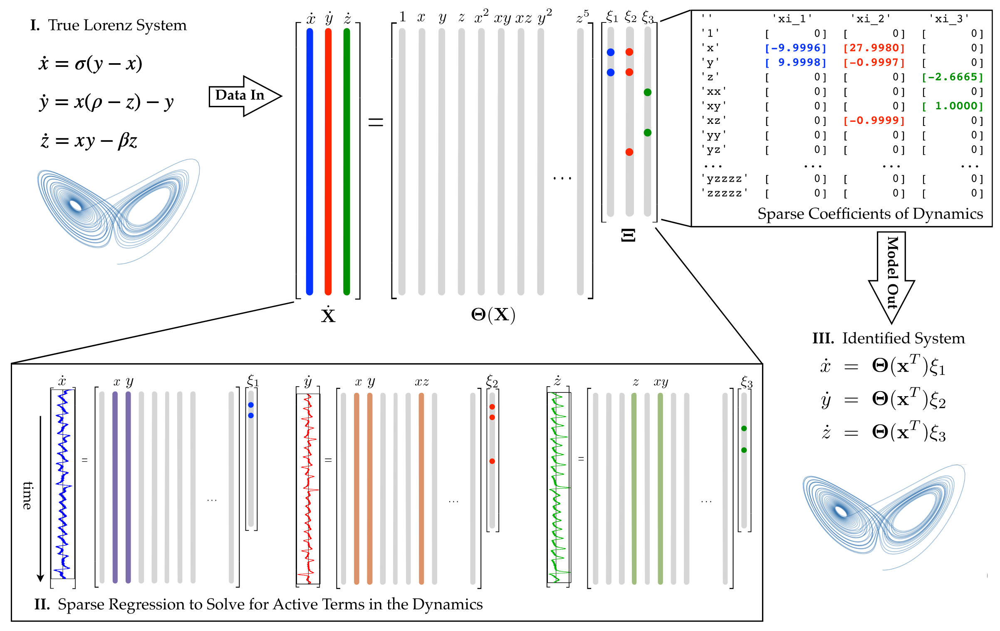

# Sparse Identification of Nonlinear Dynamics

This directory contains an implementation of *Sparse Identification of Nonlinear Dynamics* for [CTF-for-Science](https://github.com/CTF-for-Science).

Sparse Identification of Nonlinear Dynamics (SINDy)* [1] is an algorithm designed to identify nonlinear dynamical systems $\dfrac{d}{dt}𝙭(t) = 𝙛(𝙭(t))$ from time-series data. Sparsity promoting strategies are considered in order to obtain interpretable dynamical systems with few active terms in the governing equations, capable of accurately extrapolating beyond the training trajectories. Specifically, given the matrices $X$ and $\frac{d}{dt} X$ collecting, respectively the time-series $X_{i,j} = x_i(t_j)$ and $\frac{d}{dt}x_i(t_j)$ for $i=1,...,n$ and $j = 1,...,m$

the dynamical system $\dfrac{d}{dt}𝙭(t) = 𝙛(𝙭(t))$ is approximated through

$$
\dfrac{d}{dt} X = \Theta(X) \Xi
$$

where $\Theta(X)$ is a library of regressions terms (polynomials or trigonometric functions are typically considered) and $\Xi$ are the corresponding coefficients, which are determiend through linear regression. To promote sparsity, the Least Absolute Shrinkage and Selection Operator (LASSO) or Sequentially Thresholded Least SQuares (STLSQ) are typically considered to determine the coefficient values.

<br />
<p align="center" width="65%">
  
  <br />
</p>
<br />

## Files
- `sindy.py`: Contains the `SINDy` class implementing the model logic based on [pysindy](https://github.com/dynamicslab/pysindy).
- `run.py`: Batch runner script for running the model across multiple sub-datasets in the [CTF-for-Science](https://github.com/CTF-for-Science) framework.
- `config_KS.yaml`: Configuration file for running the model on `PDE_KS` test cases for all sub-datasets.
- `config_Lorenz.yaml`: Configuration file for running the model on `ODE_Lorenz` test cases for all sub-datasets.

The configuration files specify the hyperparameters for running the model with the following structure
```yaml
dataset:
  name: <dataset_name>  # Test case (e.g. PDE_KS, ODE_Lorenz)
  pair_id: 'all'        # Which sub-datasets to consider
model:
  name: SINDy
```

## Usage

In the [CTF-for-Science](https://github.com/CTF-for-Science) framework, the DeepONet model can be tested with the command

```bash
python models/sindy/run.py models/sindy/config_*.yaml
```

## Dependencies


## References
Brunton, Steven L., Joshua L. Proctor, and J. Nathan Kutz. 2016. “Discovering Governing Equations from Data by Sparse Identification of Nonlinear Dynamical Systems.” Proceedings of the National Academy of Sciences 113 (15): 3932–37. https://doi.org/10.1073/pnas.1517384113.

